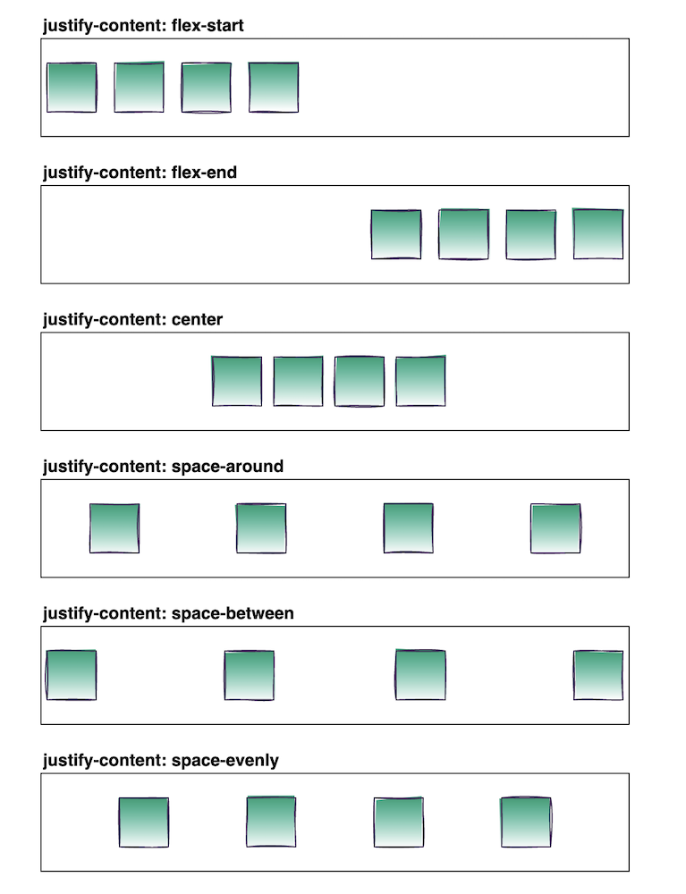
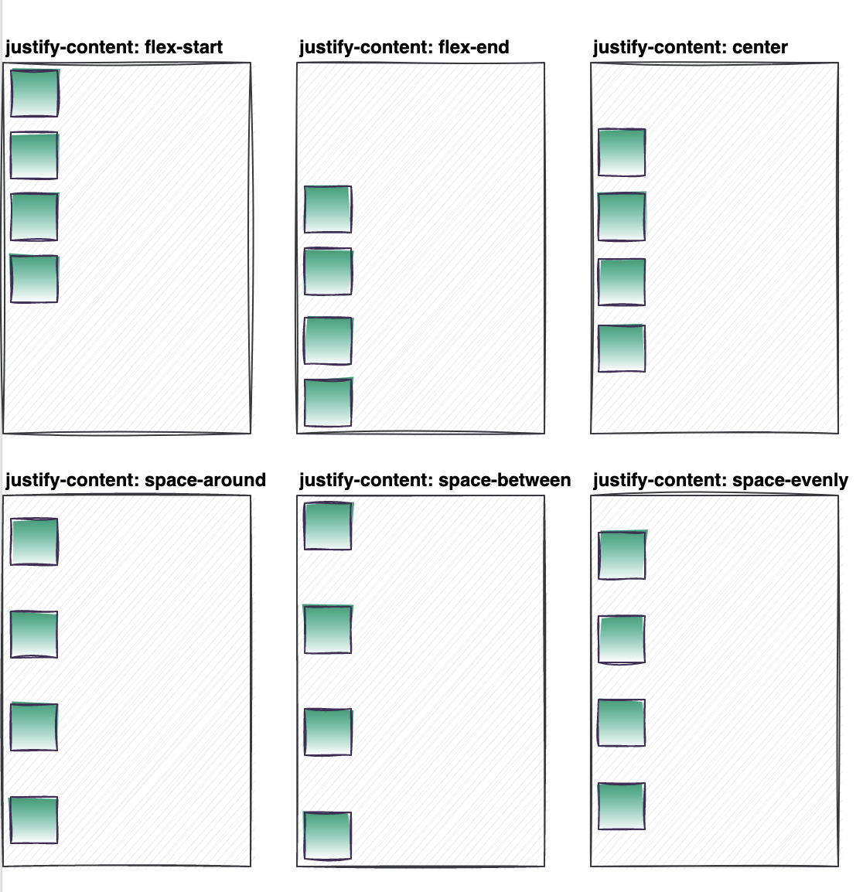
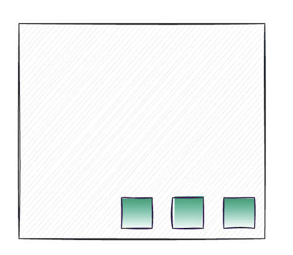
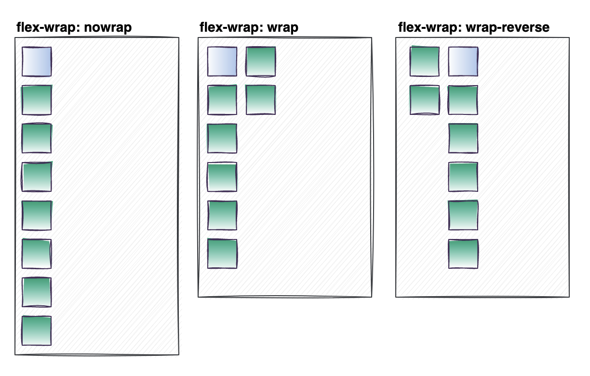
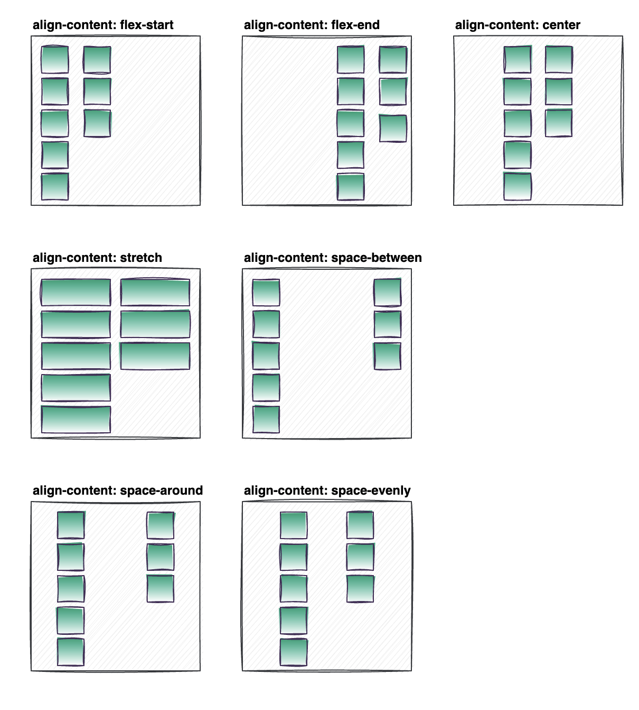

# Flexbox 1: Flex parents

Jump to:
* [Flex-direction](#flex-direction)
* [Justify-content](#justify-content)
* [Align-items](#align-items)
* [Flex-wrap](#flex-wrap)
* [Align-content](#align-content)

Flexbox is a modern layout method used to distribute items in rows or columns.  It is a value of the `display` property that relies on the parent-child relationship to determine which elements should be laid out in flexible boxes. Flexbox can help us create complex webpage layouts as well as finessing small portions of our layout. 

In most modern layouts, elements share space beside each other on a webpage. So far, the elements we have been working with have not been sharing their space with their neighboring elements. Flexbox makes laying out elements side by side a breeze.

Elements also tend to shift within a layout on different screen sizes. Sometimes elements that were sharing space on the same line will change to sit vertically on smaller screens for readability. This change can be easily done using flexbox. 

In order to use flexbox, one must first determine what elements you'd like to treat as flexible boxes. The direct parent of those elements will be your flex parent. 

To use flexbox, set `display: flex` on the flex parent. For example, in the below code, there are three `<article>` elements (which are block level elements by default) nested inside a `<section>`.

```html
<section>
  <article>
    <p>1st article</p>
  </article>
  <article>
    <p>2nd article</p>
  </article>
  <article>
    <p>3rd article</p>
  </article>
</section>
```

```css
article {
  border: 2px solid black;
}
```

This results in each `<article>` taking up the entire width of the browser. But what if we wanted to have the `<article>` elements sit next to each other? Giving `<section>` a `display` value of `flex` will allow the `<article>` elements to flex next to each other:

```css
section {
  display: flex;
}
```

The `<section>` is now acting as a *flex container* for all of its direct children, also known as *flex children*, allowing them to flow next to each other. Flex containers are central to working with flexbox; there must always be a flex container with the property `display: flex` applied.

While these notes will continue to refer to flex containers and flex children, note that these are simply terms that are being used to explain the flexbox concepts and not standard terminology. You may see these terms referred to differently in other tutorials online.

Let's download [this example](../../exercises/flexbox-starter.zip?raw=true) and create our first layout using flexbox.

## Flex axis

Flexbox works along two axes to organize the flex children: the _main axis_ and _cross axis_. The `flex-direction` property is what sets the main and cross axes. Therefore, the main and cross axes can change depending on the value of the parent's `flex-direction`.

The ability to change the direction of the flex children with one property is a very powerful concept for responsive design. A common pattern for menus in modern layouts will be to have the menu items laid out horizontally for desktop screens but then change to be vertically stacked on mobile for ease of use. This is easily accomplished with flexbox simply by changing the `flex-direction` of the parent element to flip the layout from row to a column. 


### Flex direction
`flex-direction: <keyword value>;`

#### Row
`flex-direction: row;` or `flex-direction: row-reverse;`

**Main axis becomes:** horizontal

In the example earlier, when `display: flex` was applied to the `<section>` element, making it a flex container, all of the children aligned themselves horizontally, from left to right.

That is because flex containers have the default value of `flex-direction: row`, making the main axis horizontal.

```css
.flexContainer {
  display: flex;
  /* Flex containers have a default value of flex-direction: row; */
}
```


Note that `flex-direction: row` runs in the direction of the default language of the browser. In our case, we are working in the English language, which is read from left to right.

The `flex-direction` property can also accept the value of `row-reverse`, forcing the flex children to align horizontally from in the opposite direction (in English, from right to left).

```css
.flexContainer {
  display: flex;
  flex-direction: row-reverse;
}
```


> **Accessibility tip**
>
> Using any `row-reverse` does not change the order of the elements in the HTML, and as a result, AT will still read the original order of the elements as found in the HTML. If the order of the elements impacts the user's understanding of the content, consider adjusting the original HTML elements. This also applies to `column-reverse`, mentioned below.

#### Column

`flex-direction: column;` or `flex-direction: column-reverse;`

**Main axis becomes:** vertical

To create a column using flexbox, set the `flex-direction` to the value of `column`. This will make the main axis vertical instead of horizontal and will result in flex children stacking from top to bottom.

```css
.flexContainer {
  display: flex;
  flex-direction: column;
}
```


Similar to `row`, `column` can also be reversed by setting the `flex-direction` to the value of `column-reverse`. This forces the flex children to stack from bottom to top.


## Arranging content
Once our main and cross axes are set by the `flex-direction` property, we can move our content along those axes with the `justify-content` and `align-items` properties. Both `justify-content` and `align-items` are placed on the flex parent and affect the behaviour of the flex children.


### Justify-content
`justify-content: <keywords>;`

The `justify-content` property distributes content and free space along the main axis between flex children. It accepts the following values:

* `flex-start`: Flex children are aligned towards the "start" of flex parent. This is the default value for `justify-content`.
* `flex-end`: Flex children are aligned towards the "end" of the flex parent along the main axis.
* `center`: Flex children are centered in the flex parent.
* `space-around`: Flex children have the available white space distributed between them. Note that this does not mean that the spacing will be equal.
* `space-between`: Flex children have the available white space distributed between them, with the first flex child flush with the "start" of the flex parent, and the last flex child flush with the "end" of the flex parent.
* `space-evenly`: Flex children have the available space distributed between them, resulting in even space between each element. This value is not currently supported on Internet Explorer or older versions of Edge.

This behavior is similar to how word processors like Word or Google docs allow you to justify text to left-side/right-side margins or center.   

Below is an illustration of these properties when used on a flex parent where `flex-direction` is set to `row`. 



Below is an illustration of these properties when used on a flex parent where the `flex-direction` has been set to `column`. Notice that `justify-content` is now determining how space will be distributed along the main axis which has changed direction and is running from top to bottom. 


### Align-items
`align-items: <keywords>;`

The `align-items` property aligns content along the cross axis. It accepts the following values:

* `stretch`: Flex children stretch to fit the available space if there is no height or width already set. This is the default value of `align-items`.
* `flex-start`: Flex children are aligned towards the "start" of the cross axis.
* `flex-end`: Flex children are aligned towards the "end" of the cross axis.
* `center`: Flex children are centered on the cross axis.
* `baseline`: Flex children are centered along the baseline of their content. The baseline can be thought of as the invisible line on which text content sits.

Just like `justify-content`, if the `flex-direction` of the parent container is changed, `align-items` behavior will also change as the cross axis has shifted. 

Below is an illustration of the various `align-items` properties when `flex-direction` is set to `row`. 


Below is an illustration of the various `align-items` properties when `flex-direction` is set to `column`.


### Combining properties 
`justify-content` and `align-items` can be combined on a single flex parent to arrange flex children around both axes.

For example, if content needs to sit in the bottom right corner of a flex parent, using `flex-end` on both `justify-content` and `align-items` would achieve this. 

```css
.flexParent {
  display: flex;
  justify-content: flex-end;
  align-items: flex-end;
}
```
Note that `flex-direction` is not explicitly applied to the flex parent. That is because we want the flex direction to be `row`, which is the default value, saving us a line of code! If you prefer to include it, you may.



Flexbox has made a historically difficult task very easy: centering an item both vertically and horizontally. In the below example, we are using flexbox to center some text both horizontally and vertically inside of a header that has been set to `100vh`.

```css
.flexParent {
  display: flex;
  justify-content: center;
  align-items: center;
  height: 100vh;
}
```


Combining the `justify-content` and `align-items` properties, you can also use flexbox to center elements vertically but have them sit apart from each other within their flex parent. In the example below the `h2` and the `img` elements are the flex children. They are being distributed along the main and cross axis using both of these properties.

```css
.flexParent {
  display: flex;
  justify-content: space-between;
  align-items: center;
}
```


## Multi-line content
Flexed items will do everything they can to stay on one line, shrinking as small as possible to make that happen. This means they will never "spill" over to a new line like we might expect them too.

In the code below, the flex parent's width is set to `400px` and the flex children have a width of `100px`. Despite their width, flexbox will manipulate the flex children so they sit on one line, ignoring the set width. 

```html
<section>
  <div></div>
  <div></div>
  <div></div>
  <div></div>
  <div></div>
  <div></div>
  <div></div>
</section>
```

```css
section {
  display: flex;
  height: 400px;
  width: 400px;
}

div {
  width: 100px;
  height: 100px;
  background: lightseagreen;
  border: 2px solid darkslategrey;
}
```

The `<div>`s become smaller without spilling over to a new line despite having a fixed width of 100px on them.


### Flex-wrap
`flex-wrap: <keywords>;`

Flexbox has the `flex-wrap` property to control if flex children will "wrap" to the next line or not. It is set on the flex parent. It accepts the following values:

* `nowrap`: All flex children will remain on one line. This is the default value.
* `wrap`: Flex children will wrap onto multiple lines.
* `wrap-reverse`: Flex children will wrap in the reverse order as they would have normally.

When used with `flex-direction: row`,  making the horizontal axis the main axis. It wraps top to bottom:


    
 When used with `flex-direction: column`,  making the vertical axis the main axis. It wraps right to left. In order for `flex-wrap:wrap` to have an effect when flex-direction is set to `column`, the parent container must have a set height. 



The `flex-wrap` property is handy when we want our flex children to sit side by side but also respect the width limitations of their parent element. 
In the below example, all of the img tags have been given a width of 50%. Without `flex-wrap: wrap`, this width will not be respected. However, with `flex-wrap: wrap`, the images will take up 50% of the width of their parent container while still sitting side by side when possible. 

```css
.flexParent {
  border: 2px solid darkgreen;
  display: flex;
  flex-wrap: nowrap;
}
img {
  display: block;
  /* This width is being overwritten by flexbox */
  width: 50%;
}
```


```css
.flexParent {
  border: 2px solid darkgreen;
  display: flex;
  flex-wrap: wrap;
}
img {
  display: block;
  width: 50%;
}
```


> **Accessibility tip**
>
> `flex-wrap: wrap-reverse` is not ideal for accessibility as it breaks the expected flow of information; users have reasonable expectations that information will flow in directions that they are use to. For example, users who speak English as a primary language would expect items to wrap from top to bottom.


## Align-content

`align-content: <keywords>;`

`justify-content` and `align-items` are extremely useful for aligning content along the two axes, but can only help control how flex children are aligned along single lines, not how multiple lines of flex children interact with each other. Once flexed items are given the chance to wrap to multiple lines, the `align-content` property can help developers control how those lines interact with each other by delegating how the remaining space between the lines is used. It is applied to the flex parent and has the following values:

* `stretch`: Spacing between lines is stretched to take up the remaining space. This is the default value.
* `flex-start`: Spacing between lines is packed to the "start" of the container.
* `flex-end`: Spacing between lines is packed to the "end" of the container.
* `center`: Spacing between lines is packed to the center of the container.
* `space-between`: Spacing between lines is divided equally, with the first line of flex children touching the "start" of the container, and the last line touching the "end" of the container.
* `space-around`: Spacing around and between lines is divided among them. Note that this does not necessarily mean the space is even between the lines.
* `space-evenly`: Spacing around and between lines is divided evenly among them.

When used with `flex-direction: row`,  making the horizontal axis the main axis, `align-content` will produce the following results.


When used with `flex-direction: column`,  making the vertical axis the main axis, `align-content` will produce the following results.



Note that a flex parent with `flex-direction: column;` would need to have a set height (ie. `height: 50vh`) in order for `flex-wrap: wrap` to take effect, otherwise the parent container will continue to grow in height to accommodate its child elements.

`align-content` has no effect on a single line of flexed items. There must be more than one line for it take effect and the above examples are only looking at flexed items that have the value of `flex-wrap: wrap`.


## Flexbox and CSS Grid

We are not going to cover CSS Grid in this course, however, it is another common way used to layout content. A lot of the layouts that you can achieve with Grid, you can also do with flexbox. However, part of web development is choosing the correct tool for the job. Flexbox excels in situations where you don't need your layout to have a rigid feel, or where you aren't sure how many items you are going to have in a layout. flexbox is really good at distributing space and aligning content. As such, it is very effective when dealing with items of different sizes. 


## Flexbox Froggy

Flexbox Froggy is a popular game where you can test your flexbox skills! As you advance through the  levels, there will be more advanced flexbox properties - try to see if you can figure them out!

Try out Flexbox Froggy [by clicking here](https://flexboxfroggy.com/).

## Exercises
* Use Flexbox to align elements in this [header and navigation exercise](../../exercises/flexbox-header-exercise--conEd.zip?raw=true). The folder contains the answer key.

* Additional Flexbox box exercises: [download the folder by clicking here](https://hychalknotes.s3.amazonaws.com/flexbox1-practice--conEd.zip). The folder includes the answer key.

## Resources
* [Learn CSS Flexbox](http://learnlayout.com/flexbox.html)
* [CSS Tricks guide to Flexbox](https://css-tricks.com/snippets/css/a-guide-to-flexbox/)
* [Known Flexbox Bugs in IE](https://github.com/philipwalton/flexbugs)
